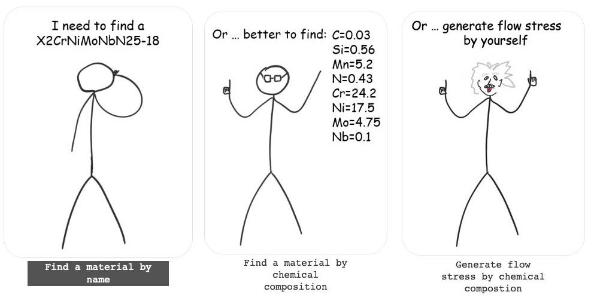

# Danila Avramenko  
Male, 31 years, born on 4 July 1991  

[Email](mailto:danila.avramenko@gmail.com) / [LinkedIn](https://www.linkedin.com/in/danila-avramenko-77912ab9/)  
 
Residence in Montenegro.   
Ready to relocate, ready for business trips.

___
## Skills
Experienced metal forming engineer, naturally converted into a programmer.  

Key engineering skills: FEM simulation, Forging, Ring Rolling, Rolling, Technology design, Technology optimization, CAD systems, Technical support

Key programming skills: Python, REST API, Git, ML, C++, Docker, Postgresql, SQLite3, Flask, MongoDB, Telegram bots, Graphana, Kibana, Agile, Scrum

___
## Experience

**Backend Python developer @ [Yandex Eats](https://www.wikiwand.com/en/Yandex_Eda)**  
_Moscow, Russia (July 2021 - Present)_  
- Developing microservices using Python,  C++ (if really necessary 😊), and utilizing YAML for configuration.
- Writing tests using pytest and gtest.
- Designing APIs and specifying endpoints with OpenAPI.
- Creating monitoring and alerting systems.
- Developing an automated system to efficiently and accurately respond to specific user support requests.

**Software Developer @ [QuantorForm](https://www.linkedin.com/company/quantor-form/about/)**  
_Moscow, Russia (October 2020 - July 2021)_  
- Development of the Ring rolling and Rolling modules (C++)
- Elaboration of development's direction of Rolling and Ring rolling modules

**Technical support Engineer @ [QuantorForm](https://www.linkedin.com/company/quantor-form/about/)**  
_Moscow, Russia (October 2015 - October 2020)_  
- Finite element simulation of different metal forming technologies: Open die forging, Closed die forging, Ring rolling, Longitudinal rolling, Cross rolling, Rotary forging, Extrusion, Wheel rolling
- Conducting training worldwide in the simulation of a metal-forming technology
- Product development of new functionality; interface development
- Development of automated testing software by using API (Python)
- Documentation development
- Various forging processes design and optimization
- Preparing and conducting the presentation of the company's products and new versions of the software
- Technical support of the customers with main focus on the ring rolling and rolling processes

___
## Education
**Bauman Moscow State Technical University**  
_Moscow, Russia (September 2008 - June 2014)_  
- Master’s Degree in Mechanical Engineering
- Metall Forming Technology

___
## Pet Projects
**[2022] Finding memes by string. Telegram bot**  

This bot helped users to search images (memes) by entering keywords.  
Stack:  
`imagehash` - for images (memes) deduplication; hash type and hash size was selected experimentally;  
`Tesseract` - for text recognition (multiple languages simultaneously);  
`Elasticsearch` - is a search engine and DB. DB contains image hashes, recognized and processed text

MVP: telegram bot (hosted locally) and static DB (13 000 memes). The operability has been checked on my friends.

I've decided then to change the project architecture; to make the bot work perfectly; to add automatic continuous enrichment of the memes DB. The project is on hold now =()

 

**[2022] Order readiness notification. Telegram bot**  

Bot for bar Zionist (Moscow) was developed to cover the issue of ppl not knowing when to pick up the food from the counter (foodcourt system). The path was: clients order the food at the counter and after some time should come to pick it up. Normally clients could make this route several times till the food was ready. It was easy to launch this bot cause the co-owner of this bar is my friend.

2 bots, actually: for guests and chefs. 2 bots share the same database: `JSON-file` 🙂 This file contains orders and telegram ids to send notifications. Why JSON-file - because it's simple and the bot usage number is from 10 to 100 times a day. 
Guest sends the order number in the bot -> chef presses the button on a special keyboard with order numbers when it's ready -> guest gets a notification with the "bon appetit" in different languages.

It's a straightforward and simple solution, really useful for me, my friends and other bar guests.  

 

**[2022] Site parsing by specified parameters. Telegram bot**   

Bot sends search results every weekday: a message with statistics of results (number of the search results) + an excel table with actual results.

The finite state machine was implemented to set the source data for search. 
The subscription option was implemented after the test period. One of the payment services supported by Telegram (yookassa) was used for subscription payments. 

Base libraries: `aiogram`, `beautifulsoup`. DB: `SQLite3`. Most of the code with `type hinting`. Development and deployment using `Docker`. `Makefile` to run frequent commands: tests, linters (flake8, mypy), formatter (black), rebuilding and entering into the container. Clean DB is created for each test: DB with all actual migrations and filling with data for each test individually if necessary. `Crons`: site parsing + saving results in DB; saving results from DB into excel tables; messages formation and sending the results.

The bot was deployed on `DigitalOcean` and worked for 3 weeks for 5 familiar users, but nowadays it has lost relevance.  

 

**[2020] Pet projects for inner usage of QuantorForm**  
 
1. **Service for mechanical properties (flow stress) of steel generation**. Flow stress generates by steel chemical composition (an original approach to the problem).  
Formulation of an idea -> formalization of a task -> data collection -> data processing -> training of a regression model (Catboost) -> development of a service on Flask (drawing graphs with a small amount of JS) -> result (excel tables with graphs). Two plants use models that were generated for them on a daily basis. 

2. **Search service for materials by name and chemical composition**.
Search algorithm was written taking into account the specifics of the name of the materials for various standards. This part mostly helped technical support department to resolve customer requests.

  

 

___
## Languages

Russian (native), English  